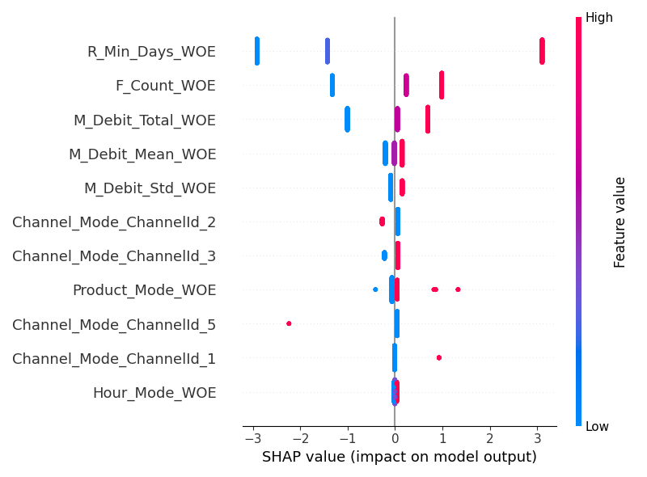

# 📉 Credit Risk Probability Model for Alternative Data


This repository contains an end-to-end Basel II-compliant Credit Scoring System for Bati Bank. It transforms raw eCommerce data into actionable credit risk insights using advanced machine learning and explainable AI (XAI).

## 🚀 Recent Engineering Updates (Week 4 Plan)
| Day | Task | Status | Proof of Work |
| :--- | :--- | :--- | :--- |
| **Wed** | Code Refactoring | ✅ Done | Implementation of Type Hints & Pydantic Schemas |
| **Thu** | Logging & Error Handling | ✅ Done | Structured JSON logging in `src/api/main.py` |
| **Fri** | SHAP Integration | ✅ Done | Local & Global justifications via `src/predict.py` |
| **Sat** | Officer Dashboard | ✅ Done | Streamlit "What-If" Analysis tool |
| **Sun** | Testing & CI/CD | ✅ Done | Automated Unit tests and GitHub Actions |
| **Mon** | Documentation | ✅ Done | Professional README and Demo assets |

---

## 1. Credit Scoring Business Understanding

### 1.1 Basel II Influence
This project follows Basel II standards for credit risk:
* **Interpretability:** Logistic Regression with Weight of Evidence (WoE) ensures human-readable coefficients.
* **Justification:** Every API response includes a SHAP-based explanation for "Why" a customer was flagged.

### 1.2 Proxy Target Variable Engineering
Since loan default data was unavailable, we engineered a **Proxy Target**:
* **K-Means Clustering ($k=3$):** Segmented users based on RFM (Recency, Frequency, Monetary) data.
* **Labeling:** The "Least Engaged" cluster (High Recency, Low Frequency) is designated as **High Risk (1)**.

---

## 2. 🧠 Model Interpretability (SHAP)
We don't just provide a "High Risk" label; we provide a mathematical justification.

### Global Explanations
The following plot (generated during training) shows the features that most impact the model across the entire customer base:



### Local Explanations (API Level)
The `/predict` endpoint returns a `justification` object. Example:
```json
{
  "risk_label": "High Risk",
  "justification": {
    "R_Min_Days_WoE": 1.45,
    "F_Count_WoE": -0.82
  }
}

```

---

## 3. 🖥️ Credit Officer Dashboard

Built with **Streamlit**, the dashboard allows non-technical bank staff to:

* **Simulate Scenarios:** Use sliders to change customer behavior and see real-time risk updates.
* **Comparison Mode:** Compare two different customer profiles side-by-side to determine loan eligibility.

**To Run:** `streamlit run src/dashboard.py`

---

## 4. 🚀 Usage and Workflow

### A. Training & MLflow Tracking

```bash
python -m src.train
mlflow ui

```

### B. API Deployment (FastAPI)

The API is hardened with Pydantic validation and structured logging.

```bash
uvicorn src.api.main:app --reload

```

* **Swagger UI:** [http://localhost:8000/docs]()
* **Health Check:** [http://localhost:8000/health]()

---

## 5. 🛡️ Quality Assurance (CI/CD)

* **Linting:** `Black` and `Flake8` for style consistency.
* **Security:** `Safety` scan for dependency vulnerabilities.
* **Testing:** `Pytest` covering RFM logic and API stability.